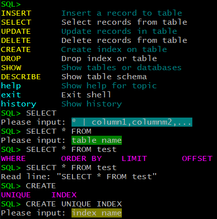
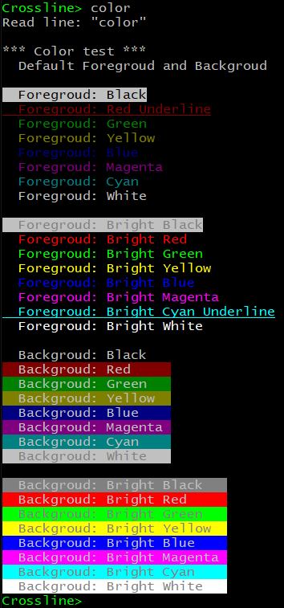

# Crossline

**Crossline** is a small, self-contained, zero-config, MIT licensed, cross-platform, readline and libedit replacement.

When should you use Crossline:
* When you need a cross-platform readline: Windows, Linux, Unix, MacOS.
* When you need a simple but versatile readline: more shortcuts, advanced search, simple autocomplete, paging, cusor APIs, color APIs, embedded help, etc.
* When you need a customized readline: easy to extend.
* When you need a small readline to build into program.




## Catalogue

* [Features and Highlights](#Features-and-Highlights)
* [Background](#Background)
* [Shortcuts](#Shortcuts)
* [Multiple Line Mode](#Multiple-Line-Mode)
* [History Search](#History-Search)
* [Crossline APIs](#Crossline-APIs)
* [Color APIs](#Color-APIs)
* [Paging APIs](#Paging-APIs)
* [Cursor APIs](#Cursor-APIs)
* [Simple Example](#Simple-Example)
* [SQL Parser Example](#SQL-Parser-Example)
* [Keyboard Debug](#Keyboard-Debug)
* [Embedded Help](#Embedded-Help)
* [Extend Crossline](#Extend-Crossline)
* [Customized Config](#Customized-Config)
* [Build and Test](#build-and-Test)
* [Related Projects](#Related-Projects)


## Features and Highlights

* Support many platforms: Windows, Linux, vt100 and xterm.
* Support total `79 shortcuts` and `40 functions`.
* Support most readline shortcuts (Emacs Standard bindings): move, edit, cut&paste, complete, history, control.
* Support fast move between lines with `Up` `Down` and `Ctrl/Alt+Up` `Ctrl/Alt+Down` keys in multiple line edit mode.
* Support some Windows command line shortcuts and extend some new convenient shortcuts.
* Support history navigation, history show/clear and history save/load.
* Support readline with initial input for editing.
* Support autocomplete, key word help and syntax hints.
* Support powerful interactive history search with multiple case insensitive including and excluding match patterns.
* Support same edit shortcuts (except complete and history shortcuts) in history search mode.
* Support color text for prompt, autocomplete, hints.
* Support auto resizing when editing window/terminal size changed.
* Support autocomplete, history show/search, help info paging.
* Support cross platform paging control APIs.
* Support cross platform cursor control APIs.
* Support cross platform color control APIs.
* Support convenient embedded `F1` help in edit and history search mode, and you can call it anytime without losing current input.
* Support convenient embedded `Ctrl-^` keyboard debug mode to watch key code sequences.
* Support `Ctrl-C` to exit edit and `Ctrl-Z` to suspend and resume job(Linux) in both edit and search mode.
* Support pipe as input.
* Pure C MIT license source code, no 3rd library dependency.
* No any dynamic memory operations: malloc/free/realloc/new/delete/strdup/etc.
* Very small only about 1200 LOC, and code logic is simple and easy to read.
* Easy to customize your own shortcuts and new features.
* Unicode is to be supported later.

## Background

I'm developing a cross-platfrom command line tool which can support autocomplete and history. **Readline** library is the first choice, but it can't use on Windows directly and you need to link the readline library explicitly. You also need to install the libreadline-dev package to build and if target machine version mismatches with build machine, the program can't run. The libreadline has over 30K LOC and has two so files: libreadline.so libhistory.so, and it depends on libncurses also.

Then I searched and found there's a small readline replacement **linenoise** written by Redis's author. Linenoise is used in Redis, MongoDB, and Android. It's very small (about 1,100 LOC), but it can only run on Linux and supports few shortcuts and features. Then I found there's a more powerful library **linenoise-ng** used in ArangoDB. It's based on MongoDB's linenoise which enhanced original linenoise to support Windows, more shortcuts, features and Unicode. But the code is embedded in MongoDB source code, then ArangoDB ported it out, did some improvements and made it an independent library.

At first I planned to use linenoise-ng, but I found it's still big (about 4,300 LOC) and complex. It uses C++ and C together, and C/C++ dynamic memory is used also which is there in original linenoise. I think it can be much simpler, then I did some prototype verification, and use a different method to implement this brand new, simple, pure C cross-platform enhanced readline replacement library.

## Shortcuts

**Misc Commands**

Shortcut                | Action
---------               | ------
F1                      |   Show edit shortcuts help.
Ctrl-^                  |   Enter keyboard debugging mode.  

**Move Commands**

Shortcut                | Action
---------               | ------
Ctrl-B, Left            |   Move back a character.
Ctrl-F, Right           |   Move forward a character.
Up                      |   Move cursor to up line. (For multiple lines)
Ctrl-Up, Alt-Up, ESC+Up |   Move cursor to up line. (Ctrl-Up, Alt-Up only supports Windows/Xterm)
Down                    |   Move cursor to down line. (Ctrl-Down, Alt-Down only support Windows/Xterm)
Ctrl-Down, Alt-Down, ESC+Down |   Move cursor to down line. (Ctrl-Down, Alt-Down only support Windows/Xterm)
Alt-B, Ctrl-Left, Alt-Left, ESC+Left    | Move back a word. (Ctrl-Left, Alt-Left only support Windows/Xterm)
Alt-F, Ctrl-Right, Alt-Right, ESC+Right | Move forward a word. (Ctrl-Right, Alt-Right only support Windows/Xterm)
Ctrl-A, Home            |   Move cursor to start of line.
Ctrl-E, End             |   Move cursor to end of line.
Ctrl-L                  |   Clear screen and redisplay line.

**Edit Commands**

Shortcut                | Action
---------               | ------
Ctrl-H, Backspace       |   Delete character before cursor.
Ctrl-D, DEL             |   Delete character under cursor.
Alt-U                   |   Uppercase current or following word.
Alt-L                   |   Lowercase current or following word.
Alt-C                   |   Capitalize current or following word.
Alt-\                   |   Delete whitespace around cursor.
Ctrl-T                  |   Transpose previous character with current character.

**Cut&Paste Commands**

Shortcut                | Action
---------               | ------
Ctrl-K, Ctrl-End, Alt-End, ESC+End       | Cut from cursor to end of line. (Ctrl-End, Alt-End only support Windows/Xterm)
Ctrl-U, Ctrl-Home, Alt-Home, ESC+Home    | Cut from start of line to cursor. (Ctrl-Home, Alt-Home only support Windows/Xterm)
Ctrl-X                  |   Cut whole line.
Alt-Backspace, Clt-Backspace, Esc+Backspace  | Cut word to left of cursor. (Clt-Backspace only supports Windows/Xterm)
Alt-D, Alt-Del, Ctrl-Del, ESC+Del        | Cut word following cursor. (Alt-Del,Ctrl-Del only support Windows/Xterm)
Ctrl-W                  |   Cut to left till whitespace (not word).
Ctrl-Y, Ctrl-V, Insert  |   Paste last cut text.

**Complete Commands**

Shortcut                | Action
---------               | ------
TAB, Ctrl-I             |   Autocomplete.
Alt-=, Alt-?            |   List possible completions.

**History Commands**

Shortcut                | Action
---------               | ------
Ctrl-P, Up              |   Fetch previous line in history. (Up works when cursor in first line or end of last line)
Ctrl-N, Down            |   Fetch next line in history. (Down works when cursor in last line)
Alt-<,  PgUp            |   Move to first line in history.
Alt->,  PgDn            |   Move to end of input history.
Ctrl-R, Ctrl-S          |   Search history.
F4                      |   Search history with current input.
F1                      |   Show search help when in search mode.
F2                      |   Show history.
F3                      |   Clear history (need confirm).

**Control Commands**

Shortcut                | Action
---------               | ------
Enter,  Ctrl-J, Ctrl-M  |   EOL and accept line.
Ctrl-C, Ctrl-G          |   EOF and abort line.
Ctrl-D                  |   EOF if line is empty.
Alt-R                   |   Revert line. Undo all changes made to this line.
Ctrl-Z                  |   Suspend Job. (Linux only, fg will resume edit)

**Notes**

* In multiple lines, `Up/Down` can move between lines. `Up` will fetch history when in first line or end of last line(for quick history move), and `Down` will fetch history when in last line.
* For Windows and xterm, almost all shortcuts are supported.
* For some terminal tools you need to enable Alt as meta key.
  SecureCRT: check `Terminal->Emulation->Emacs->use ALT as meta key`
* Backspace key is 8 or 127, and Del key should use Escape code.
  SecurCRT: check `Terminal->Emulation->Mapped Keys->Backspace sends delete`
* For vt100 and Linux terminals, many `Alt-key` doesn't work, and an alternate way is to press `ESC` first then press key, see above `ESC+Key`.
  Putty can send `Alt` as `ESC`, so no need to do this way.
* `Ctrl+S` is readline shortcut to search history also, but it'll halt terminal, so don't use it with Linux system, use `Ctrl+Q` to exit freezing state if pressing by mistake.

**Terminal Limitations**

* Some terminals only support `left Alt`.
* Linux console doesn't support: `Alt-?`, `Alt-<`, `Alt->`.
* SecureCRT vt100 doesn't support: `Home`, `End`, `Del`, `Insert`, `PgUp`, `PgDn`.
* SecureCRT xterm doesn't support: `Ctrl-Home`, `Alt-Home`, `Ctrl-End`, `Alt-End`, `Alt-Del`, `Ctrl-Del`, `Clt-Backspace`.

[Goto Top](#Catalogue)


## Multiple Line Mode

Crossline supports multiple line edit mode like readline. If you input a very long line and then you want to edit some part many lines above, it's not convenient to move to the position quickly even with Ctrl+Left. I used to copy input text to a GUI editor like notepad++, then edit and copy back. 

To move quickly in multiple lines, I implemented a multiple line edit mode like other editors and can use `Ctrl/Alt+Up` `Ctrl/Alt+Down` to move between lines quickly. You can also use `Up` `Down` key and to keep the original history shortcuts, the key behavior will behave as following:

* For single line, `Up` `Down` key are history shortcuts.
* In first line of multiple lines, `Down` key will move to below line, `Up` key will fetch previous history.
* In middle line of multiple lines, `Down` key will move to below line, `Up` key will move to above line.
* In last line(cursor not at end) of multiple lines, `Down` key will fetch next history, `Up` key will move to above line.
* In last line(cursor at end) of multiple lines, `Up` `Down` key are history shortcuts. This is to keep navigating history quickly.
* `Ctrl-P` `Ctrl-N` history shortcuts are not changed.

So if you want to use `Up` `Down` to move quickly between lines, make sure the cursor is not at end of last line, and if you want to navigate history quickly with `Up` `Down`, make sure the cursor is at end of last line in multiple lines.


## History Search

Original readline supports incremental search(`Ctrl-R`,`Ctrl-S`) and none-incremental search(`Alt-N`,`Alt-P`). I tried both and think they're not convenient or efficient to use, so I implemented a brand new interactive search method.

**Enter interactive history search mode**

* `Ctrl-R`: Search history.
* `F4`: Search history with current input as search patterns.

**Exit interactive history search mode**

* `Ctrl-C`: You can exit search mode anytime and keep your original input.
* `Ctrl-D`: On empty line only.

**Input patterns**

* You can use all edit shortcuts except complete and history shortcuts.
* You can use `Insert`,`Ctrl-Y`,`Ctrl-S` to paste last search patterns.
* If nothing input will show all history (`F2` can show history too).

**Patterns syntax**

You can press `F1` to get help.
Patterns are separated by `' '`, patter match is `case insensitive`.
* `select`:   choose line including `select`
* `-select`:  choose line excluding `select`
* `"select from"`:  choose line including `select from`
* `-"select from"`: choose line excluding `select from`
* `"select from" where -"order by" -limit` : choose line including `select from` and `where` and excluding `order by` or `limit`

**Select history**

* If only one history is found, id `1` is provided automatically, and you just press `Enter` to select.
* You can press `Ctrl-C` to skip choosing.
* You can press `Enter` or `Ctrl-D` on empty line to skip choosing.

**Example**

    SQL> <F2> // show history
       1  hello world
       2  select from user
       3  from select table
       4  SELECT from student
       5  Select from teacher

    SQL> <Ctrl+R>
    Input Patterns <F1> help: select from
       1  select from user
       2  from select table
       3  SELECT from student
       4  Select from teacher
    Input history id: 3
    SQL> SELECT from student<Alt+R> // Revert line

    SQL> <F4>
    Input Patterns <F1> help: <Insert> // paste last history pattern: select from
    Input Patterns <F1> help: "select from"
       1  select from user
       2  SELECT from student
       3  Select from teacher
    Input history id: 3
    SQL> Select from teacher<Alt+R>

    SQL> SELECT from<F4> // search with pattern: Select from
    Input Patterns <F1> help: SELECT from
    Input Patterns <F1> help: "SELECT from" -user -teacher
       1  SELECT from student
    Input history id: 1
    SQL> SELECT from student

[Goto Top](#Catalogue)


## Crossline APIs

```c
// Main API to read a line, return buf if get line, return NULL if EOF.
char* crossline_readline (const char *prompt, char *buf, int size);

// Same with crossline_readline except buf holding initial input for editing.
char* crossline_readline2 (const char *prompt, char *buf, int size);

// Set move/cut word delimiter, default is all not digital and alphabetic characters.
void  crossline_delimiter_set (const char *delim);

// Read a character from terminal without echo
int     crossline_getch (void);
```

* History APIs

```c
// Save history to file
int   crossline_history_save (const char *filename);

// Load history from file
int   crossline_history_load (const char *filename);

// Show history in buffer
void  crossline_history_show (void);

// Clear history
void  crossline_history_clear (void);
```

* Completion APIs

```c
typedef struct crossline_completions_t crossline_completions_t;
typedef void (*crossline_completion_callback) (const char *buf, crossline_completions_t *pCompletions);

// Register completion callback
void  crossline_completion_register (crossline_completion_callback pCbFunc);

// Add completion in callback. Word is must, help for word is optional.
void  crossline_completion_add (crossline_completions_t *pCompletions, const char *word, const char *help);

// Set syntax hints in callback
void  crossline_hints_set (crossline_completions_t *pCompletions, const char *hints);
```


## Color APIs

**Color definitions**

Color                           |  Note
---------                       |  ------
  CROSSLINE_FGCOLOR_DEFAULT     |  If not set, it's the default value.
  CROSSLINE_FGCOLOR_BLACK       |  Set text color to black. `\t` is not supported in Linux terminal, same below
  CROSSLINE_FGCOLOR_RED         |  Set text color to red.
  CROSSLINE_FGCOLOR_GREEN       |  Set text color to green.
  CROSSLINE_FGCOLOR_YELLOW      |  Set text color to yellow.
  CROSSLINE_FGCOLOR_BLUE        |  Set text color to blue.
  CROSSLINE_FGCOLOR_MAGENTA     |  Set text color to magenta.
  CROSSLINE_FGCOLOR_CYAN        |  Set text color to cyan.
  CROSSLINE_FGCOLOR_WHITE       |  Set text color to white.
  CROSSLINE_FGCOLOR_BRIGHT      |  Set text color bright.
  CROSSLINE_BGCOLOR_DEFAULT     |  If not set, it's the default value.
  CROSSLINE_BGCOLOR_BLACK       |  Set background color to black. `\t` is not supported in Linux terminal, same below. Don't use `\n` in Linux terminal, same below.
  CROSSLINE_BGCOLOR_RED         |  Set background color to red.
  CROSSLINE_BGCOLOR_GREEN       |  Set background color to green.
  CROSSLINE_BGCOLOR_YELLOW      |  Set background color to yellow.
  CROSSLINE_BGCOLOR_BLUE        |  Set background color to blue.
  CROSSLINE_BGCOLOR_MAGENTA     |  Set background color to magenta.
  CROSSLINE_BGCOLOR_CYAN        |  Set background color to cyan.
  CROSSLINE_BGCOLOR_WHITE       |  Set background color to white.
  CROSSLINE_BGCOLOR_BRIGHT      |  Set background color bright.
  CROSSLINE_UNDERLINE           |  Set text to underline style.
  CROSSLINE_COLOR_DEFAULT       |  If not set, it's the default value.

`CROSSLINE_FGCOLOR_DEFAULT`, `CROSSLINE_BGCOLOR_DEFAULT`, `CROSSLINE_COLOR_DEFAULT` are all zero, so it's fine to leave without it or just give 0.

**Color APIs**

```c
// Set text color, CROSSLINE_COLOR_DEFAULT will revert to default setting
// `\t` is not supported in Linux terminal, same below. Don't use `\n` in Linux terminal, same below.
void crossline_color_set (crossline_color_e color);

// Set default prompt color
void crossline_prompt_color_set (crossline_color_e color);

// Add completion with color.
void  crossline_completion_add_color (crossline_completions_t *pCompletions, const char *word, 
                                    crossline_color_e wcolor, const char *help, crossline_color_e hcolor);

// Set syntax hints with color
void  crossline_hints_set_color (crossline_completions_t *pCompletions, const char *hints, crossline_color_e color);

```

**Color Example**

You can get the color example code in `example2.c` `color_test()`



[Goto Top](#Catalogue)


## Paging APIs

These APIs are used internally first, then I think they're common and can be used by CLI tools also, so make them open.

```c
// Enable/Disble paging control
int crossline_paging_set (int enable);

// Check paging after print a line, return 1 means quit, 0 means continue
// if you know only one line is printed, just give line_len = 1
int  crossline_paging_check (int line_len);
```

Code in `example2.c`
```c
static void pagint_test ()
{
    int i;
    crossline_paging_set (1);
    for (i = 0; i < 256; ++i) {
        printf ("Paging test: %3d\n", i);
        if (crossline_paging_check (sizeof("paging test: ") + 3)) {
            break;
        }
    }
}
```

It'll work as following:

    Crossline> paging
    Read line: "paging"
    Paging test:   0
    Paging test:   1
    Paging test:   2
    Paging test:   3
    Paging test:   4
    Paging test:   5
    Paging test:   6
    *** Press <Space> or <Enter> to continue . . .


## Cursor APIs

These APIs are used internally first, then I think they're common and can be used by CLI tools also, so make them open and write some APIs which are not used by crossline at all.

```c
// Get screen rows and columns
void crossline_screen_get (int *pRows, int *pCols);

// Clear current screen
void crossline_screen_clear (void);

// Get cursor postion (0 based)
int  crossline_cursor_get (int *pRow, int *pCol);

// Set cursor postion (0 based)
void crossline_cursor_set (int row, int col);

/* Move cursor with row and column offset, 
 *   row_off > 0 move up row_off lines, 
 *           < 0 move down abs(row_off) lines
 *           = 0 no move for row, 
 *   similar with col_off
 */
void crossline_cursor_move (int row_off, int col_off);

// Hide or show cursor
void crossline_cursor_hide (int bHide);
```

[Goto Top](#Catalogue)


## Simple Example

`example.c` is a very simple example to use crossline.

```c
static void completion_hook (char const *buf, crossline_completions_t *pCompletion)
{
    int i;
    static const char *cmd[] = {"insert", "select", "update", "delete", "create", "drop", "show", "describe", "help", "exit", "history", NULL};

    for (i = 0; NULL != cmd[i]; ++i) {
        if (0 == strncmp(buf, cmd[i], strlen(buf))) {
            crossline_completion_add (pCompletion, cmd[i], NULL);
        }
    }

}

int main ()
{
    char buf[256];
    
    crossline_completion_register (completion_hook);
    crossline_history_load ("history.txt");

    while (NULL != crossline_readline ("Crossline> ", buf, sizeof(buf))) {
        printf ("Read line: \"%s\"\n", buf);
    }    

    crossline_history_save ("history.txt");
    return 0;
}
```

`example2.c` is an enhanced example, which supports color, color test, paging test and have the edit with initial input example.


## SQL Parser Example

`example_sql.c`, this example implements a simple SQL syntax parser with following syntax format, please read code for details.

```sql
INSERT INTO <table> SET column1=value1,column2=value2,...
SELECT <* | column1,columnm2,...> FROM <table> [WHERE] [ORDER BY] [LIMIT] [OFFSET]
UPDATE <table> SET column1=value1,column2=value2 [WHERE] [ORDER BY] [LIMIT] [OFFSET]
DELETE FROM <table> [WHERE] [ORDER BY] [LIMIT] [OFFSET]
CREATE [UNIQUE] INDEX <name> ON <table> (column1,column2,...)
DROP {TABLE | INDEX} <name>
SHOW {TABLES | DATABASES}
DESCRIBE <TABLE>
help {INSERT | SELECT | UPDATE | DELETE | CREATE | DROP | SHOW | DESCRIBE | help | exit | history}
```
You can use this example to practice the shortcuts above.

```sql
SQL> <TAB>  // show autocomplete words and help
INSERT      Insert a record to table
SELECT      Select records from table
UPDATE      Update records in table
DELETE      Delete records from table
CREATE      Create index on table
DROP        Drop index or table
SHOW        Show tables or databases
DESCRIBE    Show table schema
help        Show help for Topic
exit        Exit shell
history     Show history
 *** Press <Space> or <Enter> to continue . . .

SQL> help <TAB> // show autocomplete words list
INSERT    SELECT    UPDATE    DELETE    CREATE    DROP      SHOW
DESCRIBE  help      exit      history

SQL> CREATE INDEX <TAB> // show autocomplete hints
Please input: index name
```


[Goto Top](#Catalogue)


## Keyboard Debug

**Enter keyboard debug mode**

Press `Ctrl-^` to enter keyboard debug mode, then you can type any key or composite key, and the code sequence will be displaced. This can be used to discover new key code sequences or debug especially for Linux system with different terminals.
Note: For Windows, `Alt` key is a state, so it's not displayed.

**Exit keyboard debug mode**

Press `Ctrl-C` to exit.

**Example**

    SQL> <Ctrl-^>
    Enter keyboard debug mode, <Ctrl-C> to exit debug
     27 0x1b ( )
     91 0x5b ([)
     65 0x41 (A)
     31 0x1f ( )
     27 0x1b ( )
     91 0x5b ([)
     72 0x48 (H)


## Embedded Help

**Edit mode**

    SQL> <F1>
     Misc Commands
     +-------------------------+--------------------------------------------------+
     | F1                      |  Show edit shortcuts help.                       |
     | Ctrl-^                  |  Enter keyboard debugging mode.                  |
     +-------------------------+--------------------------------------------------+
     Move Commands
     +-------------------------+--------------------------------------------------+
     | Ctrl-B, Left            |  Move back a character.                          |
     | Ctrl-F, Right           |  Move forward a character.                       |
     | Up, ESC+Up              |  Move cursor to up line. (For multiple lines)    |
     |   Ctrl-Up, Alt-Up       |  (Ctrl-Up, Alt-Up only supports Windows/Xterm)   |
     | Down, ESC+Down          |  Move cursor to down line. (For multiple lines)  |
     |   Ctrl-Down,Alt-Down    |  (Ctrl-Down, Alt-Down only support Windows/Xterm)|
     | Alt-B, ESC+Left,        |  Move back a word.                               |
     |   Ctrl-Left, Alt-Left   |  (Ctrl-Left, Alt-Left only support Windows/Xterm)|
    *** Press <Space> or <Enter> to continue . . .

**Search mode**

    SQL> <F4> or <Ctrl+R>
    Input Patterns <F1> help: <F1>
    Patterns are separated by ' ', patter match is case insensitive:
        select:   choose line including 'select'
        -select:  choose line excluding 'select'
        "select from":  choose line including "select from"
        -"select from": choose line excluding "select from"
    Example:
        "select from" where -"order by" -limit:
             choose line including "select from" and 'where'
             and excluding "order by" or 'limit'


## Extend Crossline

You can extend crossline to add new shortcuts and action easily.

**Use keyboard debug mode to find the key code sequences**

* For Windows, most key has only one code, some function key has 2, first is 224 or 0, then follows another code. `Alt` key in Windows is a state, please refer `crossline_getkey`.
* For Linux system, most function key has an escape sequences(up to 6), and one function key may have many different escape sequences for different terminal modes, so you need to test case by case.

**Define new key**

* For `Ctrl-key`, most are single code, and you can use `CTRL_KEY(key)` directly. 
* For windows, most `Alt-key` can use `ALT_KEY(num)`.
* For Linux, most `Alt` key is escape sequences, and you can use existing macro like `ESC_KEY6`, example: `KEY_ALT_LEFT    = ESC_KEY6('1','3','D'), // xterm Esc[1;3D: Move back a word.`

**Support new Esc+key**

Please add the conversion in `crossline_key_esc2alt`

**Map new key to existing action**

* If it's a new different escape sequences for same key, please map the new key to main action key in `crossline_key_mapping`.
* If it's a new key, please add case to `crossline_readline_input`.

**Add new action**

Please add case and action code in `crossline_readline_input`.
You can refer existing case of similar action to write your new action.
Use `crossline_refreash` to print line after updating buf.

**Debug your code**

It's not easy to debug with print or debugger tools like GDB for terminal tools, and you can use `crossline_debug("xxx",...)` to print debug information to file `crossline_debug.txt`.

[Goto Top](#Catalogue)


## Customized Config

**Word delimiters for move and cut**

Default is defined by `CROSS_DFT_DELIMITER`.
```c
#define CROSS_DFT_DELIMITER            " !\"#$%&'()*+,-./:;<=>?@[\\]^_`{|}~"
```
You can modify it or use `crossline_delimiter_set` to change it.

**History**

The history line len can be less than user buf len, and it'll cut to history line len when storing to history buf.
```c
#define CROSS_HISTORY_MAX_LINE       256         // Maximum history line number
#define CROSS_HISTORY_BUF_LEN        4096        // History line length
#define CROSS_HIS_MATCH_PAT_NUM      16          // History search pattern number
```

**Completion**
```c
#define CROSS_COMPLET_MAX_LINE        512        // Maximum completion word number
#define CROSS_COMPLET_WORD_LEN        64         // Completion word length
#define CROSS_COMPLET_HELP_LEN        256        // Completion word's help length
#define CROSS_COMPLET_HINT_LEN        128        // Completion syntax hints length
```


## Build and Test

On Windows, you can add the source code to a Visual Studio project to build or enter `Tools Command Prompt for VS` from menu to build in command line which is more efficient.

**Windows MSVC**

    cl -D_CRT_SECURE_NO_WARNINGS -W4 User32.Lib crossline.c example.c /Feexample.exe
    cl -D_CRT_SECURE_NO_WARNINGS -W4 User32.Lib crossline.c example2.c /Feexample2.exe
    cl -D_CRT_SECURE_NO_WARNINGS -W4 User32.Lib crossline.c example_sql.c /Feexample_sql.exe

**Windows Clang**

    clang -D_CRT_SECURE_NO_WARNINGS -Wall -lUser32 crossline.c example.c -o example.exe
    clang -D_CRT_SECURE_NO_WARNINGS -Wall -lUser32 crossline.c example2.c -o example2.exe
    clang -D_CRT_SECURE_NO_WARNINGS -Wall -lUser32 crossline.c example_sql.c -o example_sql.exe

**GCC(Linux, MinGW, Cygwin, MSYS2)**

    gcc -Wall crossline.c example.c -o example
    gcc -Wall crossline.c example2.c -o example2
    gcc -Wall crossline.c example_sql.c -o example_sql

**Linux Clang**

    clang -Wall crossline.c example.c -o example
    clang -Wall crossline.c example2.c -o example2
    clang -Wall crossline.c example_sql.c -o example_sql

## Related Projects

* [Linenoise](https://github.com/antirez/linenoise) a small self-contained alternative to readline and libedit
* [Linenoise-ng](https://github.com/arangodb/linenoise-ng) is a fork of Linenoise that aims to add more advanced features like UTF-8 support, Windows support and other features. Uses C++ instead of C as development language.

[Goto Top](#Catalogue)
